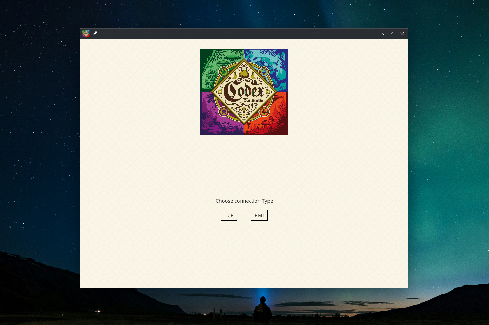
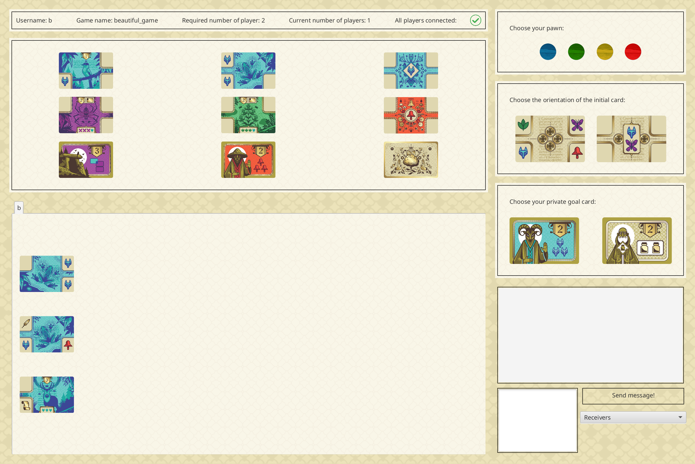
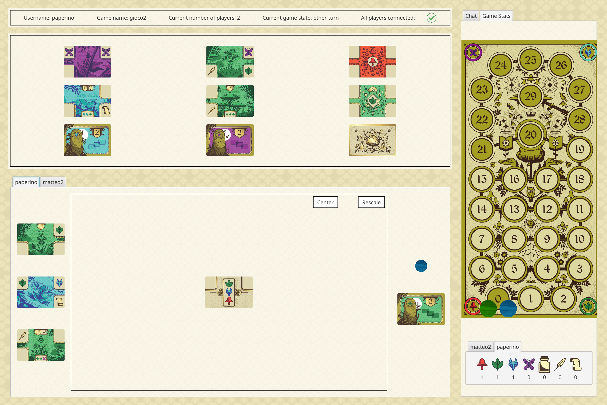
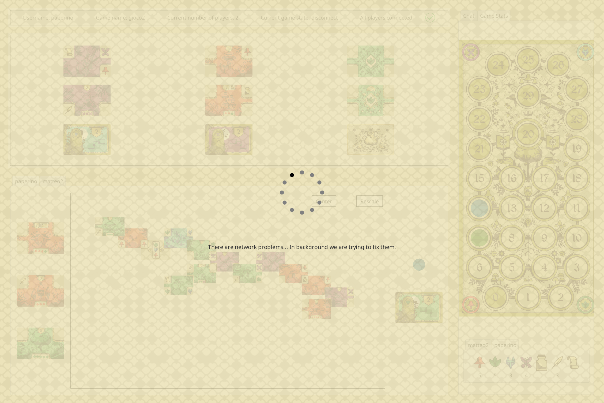

# ing-sw-2024-sood-villa-vitali-zanzottera

<div align="center">

  
Digital version of the board game *Codex Naturalis*.
</div>





## Project

Final Project of Software Engineering at Polytechnic University of Milan. A.Y. 2023/2024. Prof. Cugola Gianpaolo Saverio.

### Team GC19

- Federico Villa (10768872): federico5.villa@mail.polimi.it
- Aryan Sood (10847706): aryan.sood@mail.polimi.it
- Matteo Vitali (10800443): matteo7.vitali@mail.polimi.it
- Marco Zanzottera (10765812): marco4.zanzottera@mail.polimi.it

# Implemented functionalities
Those are the functionalities we have implemented:

<div align="center">
  
| Functionality                | State |
|:-----------------------------|:-----:|
| Basic rules                  |  :white_check_mark:  |
| Complete rules               |  :white_check_mark:  |
| TUI                          |  :white_check_mark:  |
| GUI                          |  :white_check_mark:  |
| RMI+Socket                   |  :white_check_mark:  |
| Multiple games               |  :white_check_mark:  |
| Persistence                  |  :x:  |
| Resilience to Disconnections |  :white_check_mark:  |
| Chat                         |  :white_check_mark:  |

</div>

# How to compile

Build dependencies:
- JDK 21 (recommended OpenJDK)
- maven (takes care of required dependencies defined in pom.xml)

run in the root of the project the command
```
mvn clean package
```
the compiled jars are in folder `target`, and can be run as described below.

# Software Requirements

- **OS**: Windows, MacOS, Linux
- **Java Runtime Environment** version 21

# How to run from JARs

## Server
- Download latest server jar from [releases](https://github.com/federicovilla55/ing-sw-2024-sood-villa-vitali-zanzottera/releases/latest/)
- Run in terminal: `java -jar GC19-server.jar`
- Set server IP and ports for Socket and RMI connections

## Client
- Download latest client jar from [releases](https://github.com/federicovilla55/ing-sw-2024-sood-villa-vitali-zanzottera/releases/latest/)
- Run in terminal: `java -jar GC19-client.jar`
- Set server IP and ports for Socket and RMI connections
- Select TUI or GUI (if on Windows and using TUI, see below)

### TUI on Windows Terminal
TUI game uses UTF-8 emoji characters in terminal,
supported by default on MacOS and Linux.
To enable emojis in Windows, follow these instructions:

- Get the new Windows Terminal. It has full support for Unicode and UTF-8
- Enable the new UTF-8 option in Windows settings. Go to the language settings, click Administrative language settings, then Change system locale… and tick the Beta: Use Unicode UTF-8 for worldwide language support option
- Restart your computer

# How to run from IDE (IntelliJ IDEA)

## Server
- Run `ServerApp`
- Set server IP and ports for Socket and RMI connections


## Client
- Run `ClientApp`
- Set server IP and ports for Socket and RMI connections

# Disclaimer
Codex Naturalis è un gioco da tavolo sviluppato ed edito da Cranio Creations Srl. I contenuti grafici di questo progetto riconducibili al prodotto editoriale da tavolo sono utilizzati previa approvazione di Cranio Creations Srl a solo scopo didattico. È vietata la distribuzione, la copia o la riproduzione dei contenuti e immagini in qualsiasi forma al di fuori del progetto, così come la redistribuzione e la pubblicazione dei contenuti e immagini a fini diversi da quello sopracitato. È inoltre vietato l'utilizzo commerciale di suddetti contenuti.
